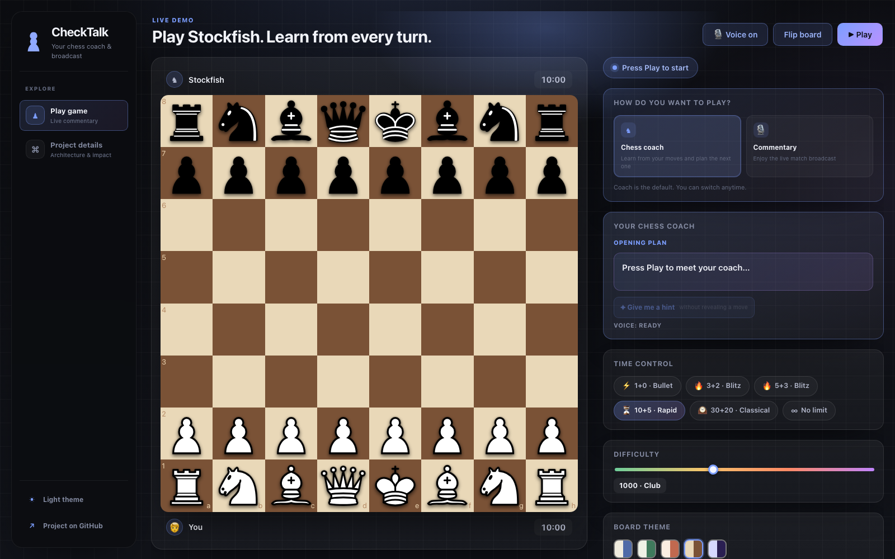
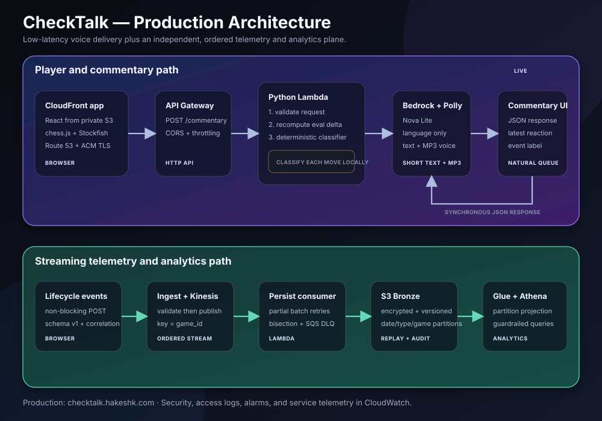
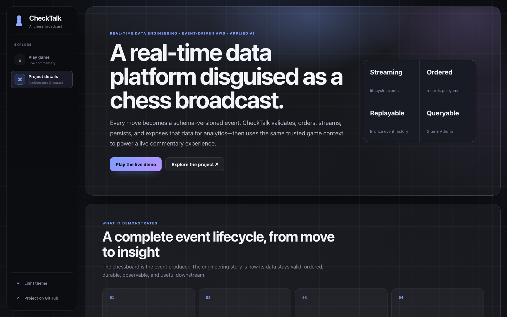

# CheckTalk

### A real-time, event-driven data platform demonstrated through live chess

[Explore the live data product](https://checktalk.hakeshk.com) · [Read the in-app engineering story](https://checktalk.hakeshk.com/#project)



## The data engineering story

CheckTalk treats a chess game as a stream of stateful business events. Every move, commentary response, and game transition produces structured data that must remain valid, ordered within its match, durable across failures, replayable for investigation, and queryable without slowing the player experience.

The chess interface is the event producer and live demonstration. Underneath it is a serverless data platform that:

1. Defines versioned event contracts with correlation identifiers.
2. Validates and bounds records at ingestion.
3. Preserves per-game order through partitioned streaming.
4. Handles consumer failures without replaying successful records.
5. Stores immutable raw events in an encrypted Bronze layer.
6. Exposes the history through a cataloged, guardrailed query layer.
7. Uses trusted operational context to support a low-latency chess coach, with live commentary as an alternate experience.

I designed and built the complete lifecycle: event modeling, ingestion, stream partitioning, fault-tolerant persistence, storage layout, metadata catalog, query controls, observability, infrastructure, deployment, and the product that generates the data.

## Why chess is a useful streaming domain

A chess game creates the same constraints found in many production data systems:

- **Ordering matters locally:** move 18 cannot be processed before move 17 within one game.
- **Parallelism matters globally:** unrelated games should process independently.
- **State evolves over time:** each event is meaningful in the context of prior events.
- **Traffic is bursty:** rapid games produce events faster than classical games.
- **Replay has value:** complete history supports game reconstruction, auditing, and new downstream consumers.
- **The operational path cannot wait:** analytics latency or failure must never block gameplay.

## Data architecture



### Analytical data plane

```text
Browser lifecycle events
          ↓
API Gateway → ingestion Lambda → Amazon Kinesis Data Streams
                                      │
                                      │ partition key = game_id
                                      ↓
                              persistence Lambda
                                      ↓
                    encrypted + versioned S3 Bronze
                                      ↓
                    AWS Glue Catalog → Amazon Athena
```

| Stage | Responsibility |
| --- | --- |
| Event producer | Emits schema version, event ID, game ID, timestamp, event type, and bounded payload. |
| Ingestion | Rejects malformed or oversized records before they enter the stream. |
| Streaming | Uses `game_id` as the Kinesis partition key to preserve match order while games scale independently. |
| Processing | Uses partial batch responses, bounded retries, batch bisection, and an SQS dead-letter queue. |
| Bronze storage | Retains encrypted, versioned source events partitioned by date, event type, and game. |
| Discovery and query | Uses Glue partition projection and Athena with a 1 GiB per-query scan guardrail. |

### Operational serving plane

```text
React + Stockfish → API Gateway → Lambda → Bedrock + Polly
```

The synchronous path serves the live product, while the analytical path remains asynchronous. Both originate from the same game domain, but analytics backpressure cannot delay a move. Stockfish and deterministic classifiers establish the facts; AI is used only to turn trusted context into a concise spoken line.

This is intentionally a data platform with an AI-powered serving use case—not an AI model presented as the system of record. The coach teaches from verified board facts and shallow engine signals; it does not claim to know an unverified best move.

## Data reliability and operability

- Versioned schemas and correlation IDs make records traceable across services.
- Per-game partitioning provides the required ordering boundary without global serialization.
- Partial batch failure handling retries only unsuccessful Kinesis records.
- Batch bisection and a dead-letter queue isolate poison records.
- S3 encryption and versioning preserve a durable raw history.
- Date, event-type, and game partitions reduce downstream scans.
- Glue partition projection avoids manual partition-registration work.
- Athena scan limits protect against unexpectedly expensive queries.
- Structured logs, CloudWatch metrics, dashboards, and alarms expose pipeline health.
- Fire-and-forget telemetry keeps data failures outside the gameplay critical path.

## Engineering decisions

| Decision | Data-engineering rationale |
| --- | --- |
| Partition by `game_id` | Preserve order only where required and retain concurrency across games. |
| Separate serving and analytics | Give each path its own latency, failure, and scaling behavior. |
| Keep immutable Bronze events | Preserve source history for audit, replay, backfill, and future transformations. |
| Validate before Kinesis | Prevent malformed payloads from becoming downstream operational debt. |
| Use partial batch responses | Avoid duplicating successful writes when one record fails. |
| Use Athena over always-on compute | Match a bursty portfolio-scale analytical workload with low idle cost. |
| Use partition projection | Make new date/type partitions queryable without a crawler dependency. |
| Treat AI as a consumer of facts | Keep domain correctness deterministic and independently testable. |

## What the data powers

The platform supports a polished live product while demonstrating that infrastructure through an understandable domain:

- Coach-first play with concise move feedback, a next-decision question after Stockfish replies, and an on-demand hint.
- An optional live commentary mode grounded in Stockfish and deterministic position context.
- Three original commentary delivery profiles.
- Multiple time controls and engine difficulty levels.
- Session history and replay for the latest three games.
- Graceful degradation when commentary, speech, or telemetry is unavailable.
- Dark/light application themes and configurable chessboard themes.



## Verification

- **49 backend unit tests** across event ingestion, persistence, coaching and commentary behavior, opening recognition, and position context.
- Stream-ingestion tests for validation, partition keys, and accepted-record responses.
- Persistence tests for S3 object layout and partial batch failures.
- Production smoke checks covering ingestion, S3 persistence, Athena visibility, and dead-letter queue health.
- Frontend static analysis and TypeScript production builds.
- Terraform configuration validation and reproducible infrastructure.
- Graceful-degradation checks that prove telemetry cannot block the player path.

## Technology

- **Streaming and storage:** Amazon Kinesis Data Streams, S3, SQS
- **Catalog and analytics:** AWS Glue, Amazon Athena
- **Processing:** Python, AWS Lambda, API Gateway
- **Operations:** CloudWatch, Terraform, GitHub Actions/OIDC
- **Data-producing application:** React, TypeScript, chess.js, Stockfish WASM
- **Applied AI serving layer:** Amazon Bedrock, Amazon Nova Lite, Amazon Polly

## Next data-engineering iterations

- Add automated schema compatibility checks and a quarantine path for invalid records.
- Transform JSON Bronze events into partitioned Parquet datasets for a curated Silver layer.
- Build replay and backfill tooling from immutable source events.
- Add data-quality SLAs for freshness, completeness, duplicates, and ordering.
- Publish operational and product metrics through an Athena-backed dashboard.
- Load-test multiple game partitions and tune shard capacity from measured throughput.

## Repository scope

This public repository is an intentionally focused engineering showcase. It contains product screenshots and system-design documentation, but not deployable application source, production infrastructure, environment configuration, or operational runbooks. The complete implementation is maintained privately and can be walked through during an interview.

---

Built by [Hakesh Kumar](https://github.com/HakeshKumar). The live system is available at [checktalk.hakeshk.com](https://checktalk.hakeshk.com).
